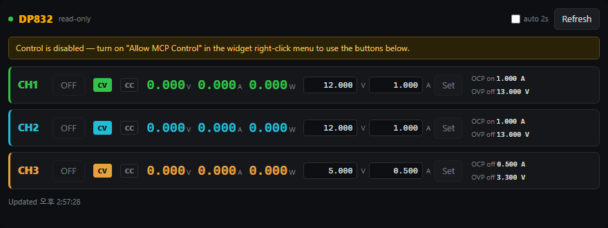

# RigolWidget

[](https://github.com/firepooh/RigolWidget/releases/latest)
[](https://github.com/firepooh/RigolWidget/releases)
[](LICENSE)


[한국어](README.md) · **English**

An always-on-top **control widget for RIGOL DP800-series DC power supplies** for the Windows desktop. It strips the chart out of RIGOL's stock PC software (Ultra Power) and keeps only what you actually use day to day: **channel control and monitoring** (CH1–CH3, depending on model). It talks to the instrument over USB (VISA/SCPI) and, on connect, auto-detects the model via `*IDN?` to set the channel count, title, and rating ranges.


## Features

- **Auto model detection** — reads the model via `*IDN?` on connect and auto-sets the **channel count (1–3)**, title, and per-channel voltage/current ratings (DP832, DP831, DP821, DP811 and their A variants)
- **Live measurement** — shows each channel's voltage/current (up to CH3, model-dependent) on a seven-segment (VFD) display
- **CV/CC mode indicator** — reflects the instrument's current operating mode (constant voltage/current) in real time
- **Output ON/OFF** — per-channel vertical toggle switch
- **Voltage/current setpoints** — adjust directly by clicking the reading (popup) or with the mouse wheel
- **Protection** — enable OCP (over-current) / OCV (over-voltage, SCPI OVP) and set thresholds; TRIP warning and clear on a protection event
- **Auto-connect** — remembers the last device and skips the selection window on later launches (falls back to the selection window when the instrument is swapped)
- **Auto reconnect** — keeps retrying the last device if USB drops during operation
- **AI control (embedded MCP server)** — an MCP client such as Claude can read and control the supply in natural language (off by default, opt-in)
- **Widget UX** — always on top, frameless drag-to-move, opacity control, magnetic edge snapping

## Usage

### 1. Select a device

When you launch the app, a device-selection window appears first. Pick your DP832 from the list of connected USB instruments and connect. (USB interface only)


#### Auto-connect (skip this window from the second launch on)

Connect with **`Remember this device and connect automatically`** checked, and the next launch connects straight to that instrument — no selection window. Handy for a fixed bench setup.

| Situation | Behaviour |
|---|---|
| Saved device is present | Connects immediately, no window |
| Same device moved to another USB port | **Matched by serial number** and connected (the changed `USB0→USB1` prefix is re-saved) |
| Device replaced / missing | Selection window with a short explanation |
| USB not enumerated yet (just after boot) | Rescans up to 3 times (~2 s) before giving up |

- **Show the window again**: hold `Shift` while launching, or run `RigolWidget.exe --select`
- **Swap devices while running**: **right-click the title bar → `Change Device…`** (no restart; the new instrument's model and channel count are re-detected)
- **Pin a device in a shortcut**: `RigolWidget.exe --device "USB0::0x1AB1::0x0E11::DP8C200300243::INSTR"`
- Stored as `AutoConnect` / `LastResource` in `%APPDATA%\RigolWidget\settings.json`.

### 2. Operate the main widget

| Target | Action | How |
|---|---|---|
| **Output toggle** | Channel ON/OFF | Click the left vertical switch |
| **Voltage/current setpoint** | Precise entry | **Click** the reading (green/cyan digits) → enter a number, use step buttons, `Apply` in the popup |
| | Quick step | **Mouse wheel** over the reading (voltage ±1 V / current ±0.1 A) |
| | Fine step | **Ctrl + mouse wheel** (voltage ±0.1 V / current ±0.01 A) |
| **OCP / OCV** | Enable/disable protection | Click the checkbox in the right protection group |
| | Change threshold | Type a number in the adjacent box and press Enter |
| **Clear TRIP** | Recover a protection trip | Click the red blinking `TRIP` badge |
| **Move window** | Reposition | Drag the title bar (snaps to screen edges) |
| **Mini mode** | Toggle full ↔ mini | **Double-click** the title bar |
| **Opacity** | Solid ↔ transparent | **Mouse wheel** over the title bar |
| **Always on top** | Toggle TopMost | Title-bar 📌 button, or the right-click menu |
| **Change device** | Switch to another instrument | Title-bar **right-click → `Change Device…`** |
| **Version / Close** | — | Title-bar **right-click** menu |

### 3. Mini mode

**Double-click** the title bar to switch to a compact view that keeps only the output toggles and measured voltage/current. Double-click again to return to full mode. Handy for parking just the status in a corner of a small screen.


> **Setpoint (SET) display**: the currently configured voltage/current is always shown to the right of the reading. While you adjust with the wheel the numbers blink, and the value is sent to the device about 2 seconds after you stop (to avoid flooding the instrument with commands during continuous adjustment).

### Voltage/current vs OCP/OCV

- **Voltage / current setpoint**: output regulation values. The current setpoint is a **limit**, not a cutoff — if the load draws more than this, the instrument lowers the voltage to hold the current (CC mode).
- **OCP / OCV**: protection **breakers**. When the threshold is exceeded, the output is shut off immediately (trip); you must clear it manually after removing the cause.

## Requirements

- **Windows 10/11 (x64)**
- **VISA runtime** — e.g. [NI-VISA](https://www.ni.com/visa). Required, since the app talks to the instrument through `visa32.dll`.
- **A RIGOL DP800-series supply** (USB) — see the [Supported models](#supported-models) table below
- For the framework-dependent build: [.NET 8 Desktop Runtime](https://dotnet.microsoft.com/download/dotnet/8.0)

## Supported models

On connect, the model is detected via `*IDN?` to set the title and per-channel voltage/current ratings. Rating values are built in from each model's datasheet.

| Model | Controlled channels | Ratings (CH1 / CH2 / CH3) | Support | Hardware tested |
|---|---|---|:---:|:---:|
| **DP832 / DP832A** | CH1, CH2, CH3 | 30V·3A / 30V·3A / 5V·3A | ✅ Full support | ✅ **DP832 verified** |
| **DP831 / DP831A** | CH1, CH2 | 8V·5A / 30V·2A / (CH3 excluded) | ✅ Ratings auto-applied | ⬜ Untested |
| **DP821 / DP821A** | CH1, CH2 | 60V·1A / 8V·10A / — | ✅ Ratings auto-applied | ⬜ Untested |
| **DP811 / DP811A** | CH1 (single channel) | 40V·5A / — / — | 🟡 Shown as single channel | ⬜ Untested |
| DP700 (DP711/DP712) | — | — | ❌ Unsupported | — |

- ✅ **Hardware tested**: only **DP832** (including CH3) has been verified on real hardware so far. The other DP800 models share the same SCPI command set and are expected to work, with channel count and ratings applied automatically, but they haven't been verified on hardware yet. Please try it and open an [Issue](https://github.com/firepooh/RigolWidget/issues) if anything is off.
- **CH3**: shown as a third row (amber) when the model has it. DP832 CH3 is 0–5V/3A.
- 🟡 **DP811(A)**: single-channel model, so only CH1 is shown (CH2/CH3 hidden).
- ⚠ **DP831(A) CH3**: a negative rail (0 to −30V); the positive-oriented UI does not support it, so DP831 is shown as 2 channels.
- ❌ **DP700 series**: uses a different, RS232-based command set and is not supported.

## AI control (embedded MCP server)

The widget embeds a feature that lets you **hand your power supply to an AI**. For example, you can tell Claude:

> *"Set CH1 to 3.3V and turn the output on"* · *"What's the current on both channels right now?"* · *"I'm done, turn all outputs off"* · *"Put a 1A over-current limit on CH2"*

### What is MCP? (for newcomers)

**MCP (Model Context Protocol)** is a standard that lets an AI (e.g. Claude) call the features of an external program as **tools**. In short, this widget **exposes** features like "set voltage" or "turn output on" in a form the AI understands, and the AI **calls** them when needed.

- **MCP server** = the side that provides the features → here, **this widget**
- **MCP client** = the side that calls them → AI apps like **Claude Code, Claude Desktop**
- This widget's MCP server **shares the same USB connection as the running widget**, so the AI can control the device while the widget is open with no conflict, and changes show up on screen immediately.

> You don't need to know MCP to use the widget. This is an **opt-in** feature for those who want it.

### Step 1 — Enable the MCP server in the widget

1. **Right-click** the widget title bar.
2. Click **"MCP Server"** to check it → a local server starts inside the widget at `http://127.0.0.1:7735/`. (The menu shows `MCP Server (on · :7735)`.)
3. To let the AI **change** values, also check **"Allow MCP Control"**.
   - Unchecked = **read-only** (measurements/status only, safe)
   - Checked = voltage/current/output **can be changed**
4. (Optional) Use **"Copy MCP URL"** to copy the address (`http://127.0.0.1:7735/`) to the clipboard.

Once enabled, the setting is saved and persists across restarts.

### Step 2 — Connect the widget to an AI app (Claude)

**Claude Code (CLI)**: register it with a single line in your terminal. `--scope user` means "register it for your whole account so it's available in every folder."

```bash
claude mcp add --scope user --transport http rigol http://127.0.0.1:7735/
```

Verify:

```bash
claude mcp list
# rigol: http://127.0.0.1:7735/ (HTTP) - ✓ Connected  ← success looks like this
```

- `✓ Connected` requires the **widget to be running with "MCP Server" enabled**.
- A Claude Code session that was already running won't pick up the tools immediately → **restart Claude Code** to load the `rigol` tools.
- To use it only in a specific project, drop `--scope user` (that folder only). If you registered it wrong, remove it with `claude mcp remove rigol` and re-add.

#### Using the Claude Desktop app

Claude Desktop keeps a **separate config** from Claude Code (CLI), so registering with `claude mcp add` above won't make it appear in Desktop. You add it to Desktop's config separately.

There are two ways to attach an HTTP server in Desktop:

**Option A — Connectors UI (no Node required, recommended)**

1. Claude Desktop → **Settings → Connectors → "Add custom connector"**
2. Enter name `rigol`, URL `http://127.0.0.1:7735/`, and add it
3. It connects right away as long as "MCP Server" is on in the widget.

> Note: some managed/organization accounts disable custom connectors. If you don't see "Add custom connector", use Claude Code (already works) or Option B.

**Option B — Config file + `mcp-remote` bridge (requires Node.js)**

Desktop's local MCP servers use the **stdio (command) transport**, so this HTTP server goes through the [`mcp-remote`](https://www.npmjs.com/package/mcp-remote) bridge. This **requires [Node.js](https://nodejs.org)** (if it's not installed, use Option A).

1. Claude Desktop → **Settings → Developer → "Edit Config"** to open `%APPDATA%\Claude\claude_desktop_config.json`.
2. Add the `rigol` entry under `mcpServers` (comma-separate if other entries exist):

   ```json
   {
     "mcpServers": {
       "rigol": {
         "command": "npx",
         "args": ["mcp-remote", "http://127.0.0.1:7735/"]
       }
     }
   }
   ```
3. Save and **restart Claude Desktop** to load the rigol tools.

> Summary: clients that **support HTTP directly** (Claude Code, Desktop connectors UI) use the URL `http://127.0.0.1:7735/`; clients that **only support stdio** use the `mcp-remote` bridge (needs Node).

### Step 3 — Try it

Ask Claude in natural language and it calls the tools below on its own:

> "Show me the RIGOL status" → calls `get_status` → summarizes both channels' voltage/current/output
> "Set CH1 to 5V and turn it on" → calls `set_voltage` + `set_output` (requires control to be allowed)

### Tools

| Tool | Description | Hint | Control required |
|---|---|:---:|:---:|
| `get_status` | Read all channels' measurements, setpoints, output, CV/CC, OCP/OVP and trip status | read-only | — |
| `get_identity` | Read model name, IDN and channel count | read-only | — |
| `show_panel` | **Render a live control panel inside the chat** (MCP Apps) | read-only | — |
| `set_voltage` / `set_current` | Set channel voltage / current limit | mutating | ✅ |
| `set_output` | Channel output ON/OFF | mutating | ✅ |
| `set_ocp` / `set_ovp` | Enable over-current / over-voltage protection and set thresholds | mutating | ✅ |
| `clear_trip` | Clear a protection trip (OCP/OVP) | mutating | ✅ |

Every tool also publishes MCP **tool annotations** (`readOnlyHint` / `destructiveHint` / `idempotentHint` / `openWorldHint`), so a client can tell "look at the instrument" apart from "change the instrument" — e.g. auto-approve the read tools and confirm only the mutating ones. The read tools additionally return **structured output** (`structuredContent` + `outputSchema`), so clients read values by schema instead of parsing text.

### Control panel inside the chat (MCP Apps)

Calling `show_panel` renders a working control panel right in the conversation: live measurements for every channel, plus output toggles, setpoint entry and trip clearing.



> Just ask for it ("open the RIGOL panel"). The panel's buttons are enabled only while **"Allow MCP Control"** is on; otherwise it shows the notice above.
>
> MCP Apps is an extension to the MCP standard, so the panel appears only in clients that support it (Claude desktop/web, VS Code Copilot, …). Elsewhere `show_panel` simply returns the same text and structured data as `get_status`.

### Safety

Since an AI is controlling real hardware, safety comes first:

- **Off by default**: both the MCP server and control are disabled at start — you must enable them yourself.
- **Control lock**: until "Allow MCP Control" is on, all write tools are rejected (read-only).
- **Local only**: bound to `127.0.0.1` (your PC only); not reachable from external networks.
- **Rating clamp**: every setpoint is automatically limited to the detected model's ratings (e.g. cannot exceed 30V/3A).
- **Command log**: every write command from the AI is logged to `%LOCALAPPDATA%\RigolWidget\rigolwidget.log`.
- **Refusals are errors**: a write attempted while control is off comes back as a tool *error*, not a successful response, so the AI cannot mistake it for success.

### Protocol / compatibility

The embedded server is built on MCP C# SDK **2.2.0** and supports the current spec revision **2026-07-28** (stateless requests, `server/discover`, caching hints). Clients that still use the `initialize` handshake (**2025-11-25 and earlier**) keep working too, via hybrid session mode — no change needed to an existing Claude Code/Desktop setup.

## Download

Grab it from [Releases](https://github.com/firepooh/RigolWidget/releases):

| File | Size | Requirement |
|---|---|---|
| `RigolWidget-standalone.exe` | ~80MB | .NET runtime bundled (runs with just a VISA runtime present) |
| `RigolWidget.exe` | ~4MB | Requires [.NET 8 Desktop Runtime](https://dotnet.microsoft.com/download/dotnet/8.0) + [ASP.NET Core 8 Runtime](https://dotnet.microsoft.com/download/dotnet/8.0) |

Both builds also require a separate **VISA runtime (NI-VISA, etc.)**. (The lightweight build needs the ASP.NET Core runtime for the embedded MCP server; the standalone build bundles everything.)

## Build

```
dotnet build -c Release
```

You can also open `RigolWidget.csproj` directly in Visual Studio 2022.
Executable: `bin\Release\net8.0-windows\win-x64\RigolWidget.exe`

## Releasing

Pushing a version tag triggers [GitHub Actions](.github/workflows/build.yml) to build both single-file exes (framework-dependent / self-contained) and attach them to a Release.

```
git tag v1.0.0
git push origin v1.0.0
```

## How it works

- **Instrument I/O**: P/Invokes `visa32.dll` (the VISA C API) directly to exchange SCPI commands. No NuGet/COM references — it loads the system's VISA implementation at runtime.
- **Polling**: about every 1 s it reads measurements (`:MEAS:ALL?`) and operating mode (`:OUTP:MODE?`), and every 4th cycle it does a full sync including setpoints, protection state, and trip alarms. Batched queries (`:MEAS:ALL?`, `:APPL?`) minimize the number of USB round-trips.
- **Reconnect**: on a communication error it closes the session and periodically retries the last resource. Failures are logged to `%LOCALAPPDATA%\RigolWidget\rigolwidget.log`.
- **Seven-segment display**: embeds the [DSEG7 Classic](https://github.com/keshikan/DSEG) font (SIL OFL) so the VFD style renders without installing a font on the target PC.
- **Render optimization**: separates the shadow from content, updates text only when values change, and caps always-on animation at a low frame rate to minimize idle CPU/GPU load.

## Key SCPI commands (DP832)

```
:MEAS:ALL? CHn              # measured voltage/current/power (batched)
:OUTP:MODE? CHn             # operating mode (CV / CC / UR)
:APPL? CHn                  # set voltage/current (batched)
:SOURn:VOLT <v>            # set voltage      / :SOURn:VOLT?
:SOURn:CURR <a>            # current limit    / :SOURn:CURR?
:OUTP CHn,ON|OFF           # output on/off    / :OUTP? CHn
:OUTP:OCP CHn,ON|OFF       # OCP on/off       / :OUTP:OCP:VAL CHn,<a> / :OUTP:OCP:ALAR? CHn / :OUTP:OCP:CLEAR CHn
:OUTP:OVP CHn,ON|OFF       # OVP(OCV) on/off  / :OUTP:OVP:VAL CHn,<v> / :OUTP:OVP:ALAR? CHn / :OUTP:OVP:CLEAR CHn
```

## Roadmap

- [ ] **Multiple instruments at once (MCP)** — run several supplies, each in its own widget, and let the AI tell them apart. Today the MCP port is fixed at `7735`, so running two or more at once conflicts on the port, and each server introduces itself only as `RigolWidget`, so the AI can't automatically tell which device is which. Needed work:
  - Per-instance port (auto-pick a free port / serial-based / per-device setting)
  - A device **alias (label)** reflected in the title, `get_identity`, the MCP serverInfo, and tool descriptions
  - Register each widget under its alias → route commands like *"turn on Bench1 CH1"*, while a bare *"turn on CH1"* makes the AI ask which device

## License / Notices

[MIT](LICENSE)

The seven-segment font [DSEG](https://github.com/keshikan/DSEG) is under the SIL Open Font License 1.1.

> **Unofficial project notice**: this is an **unofficial** hobby tool with no affiliation, sponsorship, or endorsement from RIGOL Technologies. "RIGOL", "DP832", etc. are trademarks of their respective owners. The widget controls real hardware, so use is at your own risk (see the no-warranty clause of the MIT license).
