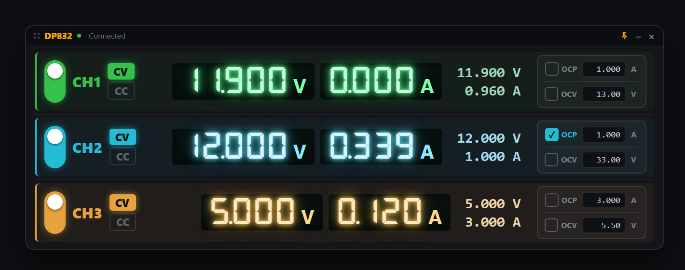
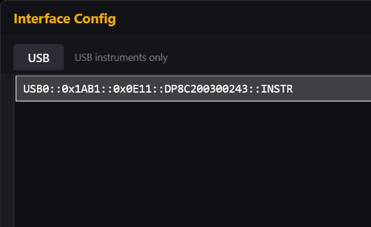
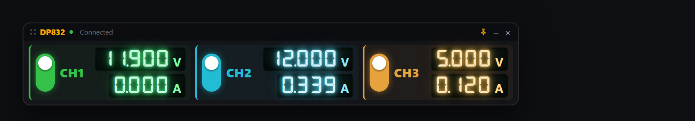

# RigolWidget

[](https://github.com/firepooh/RigolWidget/releases/latest)
[](https://github.com/firepooh/RigolWidget/releases)
[](LICENSE)


**한국어** · [English](README.en.md)

Windows 바탕화면에 항상 떠 있는 **RIGOL DP800 시리즈 전원공급기 제어 위젯**입니다. RIGOL 순정 PC 소프트웨어(Ultra Power)에서 그래프를 걷어내고, 실사용에 필요한 **채널 제어와 모니터링**만 남긴 초경량 위젯입니다(모델에 따라 CH1~CH3). USB(VISA/SCPI)로 장비와 통신하며, 접속 시 `*IDN?`로 모델을 자동 인식해 채널 수·타이틀·정격 범위를 맞춥니다.



## 기능

- **모델 자동 인식** — 접속 시 `*IDN?`로 모델을 읽어 **채널 수(1~3)**·타이틀·채널별 전압/전류 정격을 자동 설정 (DP832·DP831·DP821·DP811 및 A 변형)
- **실시간 측정** — 각 채널(모델에 따라 최대 CH3)의 전압/전류를 7세그먼트(VFD) 디스플레이로 표시
- **CV/CC 모드 표시** — 장비의 현재 동작 모드(정전압/정전류)를 실시간 반영
- **출력 ON/OFF** — 채널별 세로 토글 스위치
- **전압/전류 설정** — 측정값 클릭(팝업) 또는 마우스 휠로 직접 조정
- **보호 기능** — OCP(과전류)·OCV(과전압, SCPI OVP) 활성화 및 임계값 설정, 트립(TRIP) 발생 시 경고 표시·해제
- **연결 자동 복구** — 운용 중 USB가 끊겨도 마지막 장비로 계속 재접속 시도
- **AI 제어 (MCP 서버 내장)** — Claude 등 MCP 클라이언트가 자연어로 전원공급기를 읽고 제어 (기본 비활성, 옵트인)
- **위젯 UX** — 항상 위 고정, 프레임리스 드래그 이동, 투명도 조절, 모니터 가장자리 자석 스냅

## 사용법

### 1. 장비 선택

프로그램을 실행하면 먼저 장비 선택 창이 뜹니다. 연결된 USB 계측기 목록에서 DP832를 고른 뒤 연결합니다. (USB 인터페이스만 지원)



### 2. 메인 위젯 조작

| 대상 | 동작 | 방법 |
|---|---|---|
| **출력 토글** | 채널 ON/OFF | 왼쪽 세로 스위치 클릭 |
| **전압/전류 설정** | 정밀 입력 | 측정값(초록/시안 숫자) **클릭** → 팝업에서 숫자 입력·스텝 버튼·`적용` |
| | 빠른 증감 | 측정값 위에서 **마우스 휠** (전압 ±1 V / 전류 ±0.1 A) |
| | 미세 증감 | **Ctrl + 마우스 휠** (전압 ±0.1 V / 전류 ±0.01 A) |
| **OCP / OCV** | 보호 켜기·끄기 | 오른쪽 보호 그룹의 체크박스 클릭 |
| | 임계값 변경 | 옆 입력칸에 숫자 입력 후 Enter |
| **TRIP 해제** | 보호 트립 복구 | 빨갛게 깜빡이는 `TRIP` 배지 클릭 |
| **창 이동** | 위치 변경 | 타이틀바 드래그 (화면 가장자리에 자석 스냅) |
| **미니창 모드** | 전체 ↔ 미니 전환 | 타이틀바 **더블클릭** |
| **투명도** | 진하게 ↔ 투명 | 타이틀바 위에서 **마우스 휠** |
| **항상 위 고정** | TopMost 토글 | 타이틀바 📌 버튼, 또는 우클릭 메뉴 |
| **버전 확인 / 닫기** | — | 타이틀바 **우클릭** 메뉴 |

### 3. 미니창 모드

타이틀바를 **더블클릭**하면 출력 토글과 측정 전압/전류만 남긴 초소형 뷰로 전환됩니다. 다시 더블클릭하면 전체 모드로 돌아옵니다. 좁은 화면 한쪽에 상태만 띄워두기 좋습니다.



> **설정값(SET) 표시**: 측정값 오른쪽에 현재 설정된 전압/전류가 항상 표시됩니다. 휠로 조정하는 동안에는 숫자가 깜빡이며, 조작을 멈추고 약 2초 뒤 장비로 전송됩니다(연속 조작 중 과도한 명령 전송 방지).

### 전압/전류 vs OCP/OCV의 차이

- **전압 / 전류 설정**: 출력 레귤레이션 값입니다. 전류 설정은 "차단"이 아니라 **제한(리미트)** 으로, 부하가 이 값을 넘게 요구하면 장비가 전압을 낮춰 전류를 묶습니다(CC 모드).
- **OCP / OCV**: 보호 **차단기**입니다. 설정 임계값을 넘으면 출력을 즉시 끄고(트립), 원인 제거 후 수동 해제해야 다시 켜집니다.

## 요구 사항

- **Windows 10/11 (x64)**
- **VISA 런타임** — [NI-VISA](https://www.ni.com/visa) 등. `visa32.dll`을 통해 장비와 통신하므로 반드시 필요합니다.
- **RIGOL DP800 시리즈** (USB 연결) — 아래 [지원 모델](#지원-모델) 표 참고
- 프레임워크 의존 버전 실행 시 [.NET 8 Desktop Runtime](https://dotnet.microsoft.com/download/dotnet/8.0)

## 지원 모델

접속 시 `*IDN?`로 모델을 인식해 타이틀 표시와 채널별 전압/전류 정격을 자동으로 맞춥니다. 정격 값은 각 모델의 데이터시트를 기준으로 내장돼 있습니다.

| 모델 | 제어 채널 | 정격 (CH1 / CH2 / CH3) | 지원 수준 | 실제 테스트 |
|---|---|---|:---:|:---:|
| **DP832 / DP832A** | CH1, CH2, CH3 | 30V·3A / 30V·3A / 5V·3A | ✅ 완전 지원 | ✅ **DP832 검증 완료** |
| **DP831 / DP831A** | CH1, CH2 | 8V·5A / 30V·2A / (CH3 제외) | ✅ 정격 자동 적용 | ⬜ 미검증 |
| **DP821 / DP821A** | CH1, CH2 | 60V·1A / 8V·10A / — | ✅ 정격 자동 적용 | ⬜ 미검증 |
| **DP811 / DP811A** | CH1 (단일 채널) | 40V·5A / — / — | 🟡 단일 채널로 표시 | ⬜ 미검증 |
| DP700 (DP711/DP712) | — | — | ❌ 미지원 | — |

- ✅ **실제 테스트**: 현재 **DP832**(CH3 포함)만 하드웨어로 검증했습니다. 나머지 DP800 모델은 SCPI 명령셋이 동일해 동작이 예상되며 채널 수·정격은 자동 적용되지만, 실물 검증은 아직입니다. 사용해 보시고 이상이 있으면 [Issue](https://github.com/firepooh/RigolWidget/issues)로 알려주세요.
- **CH3**: 모델에 CH3가 있으면 세 번째 행(앰버 색)으로 표시됩니다. DP832 CH3는 0~5V/3A입니다.
- 🟡 **DP811(A)**: 단일 채널 모델이라 CH1만 표시됩니다(CH2/CH3 숨김).
- ⚠ **DP831(A) CH3**: 음(−)전압 레일(0~−30V)이라 현재 UI(양전압 기준)에서는 지원하지 않아 2채널로 표시됩니다.
- ❌ **DP700 시리즈**: RS232 기반의 다른 명령셋을 사용해 지원하지 않습니다.

## AI 제어 (내장 MCP 서버)

이 위젯은 **AI에게 전원공급기를 맡길 수 있는** 기능을 내장하고 있습니다. 예를 들어 Claude에게 이렇게 말하면 됩니다:

> *"CH1을 3.3V로 설정하고 출력 켜줘"* · *"지금 두 채널 전류 얼마야?"* · *"작업 끝났으니 전부 출력 꺼줘"* · *"CH2에 과전류 1A 보호 걸어줘"*

### MCP가 뭔가요? (처음이신 분들을 위해)

**MCP(Model Context Protocol)** 는 AI(예: Claude)가 외부 프로그램의 기능을 **도구(tool)** 로 불러 쓸 수 있게 해주는 표준 규약입니다. 쉽게 말해, 이 위젯이 "전압 설정", "출력 켜기" 같은 기능을 AI가 이해할 수 있는 형태로 **노출**하고, AI가 필요할 때 그 기능을 **호출**하는 방식입니다.

- **MCP 서버** = 기능을 제공하는 쪽 → 여기서는 **이 위젯**
- **MCP 클라이언트** = 기능을 불러 쓰는 쪽 → **Claude Code, Claude Desktop** 등 AI 앱
- 이 위젯의 MCP 서버는 **실행 중인 위젯과 같은 USB 연결을 공유**하므로, 위젯을 켜 둔 채로 AI가 제어해도 충돌이 없고 화면에도 바로 반영됩니다.

> MCP를 몰라도 위젯 자체는 그냥 쓰면 됩니다. 이 기능은 **원하는 사람만** 켜는 선택 기능입니다.

### 1단계 — 위젯에서 MCP 서버 켜기

1. 위젯 타이틀바를 **마우스 우클릭** 합니다.
2. **"MCP 서버"** 를 클릭해 체크 → 위젯 안에서 로컬 서버가 `http://127.0.0.1:7735/` 로 시작됩니다. (메뉴에 `MCP 서버 (켜짐 · :7735)` 로 표시)
3. AI가 값을 **바꾸게** 하려면 **"MCP 제어 허용"** 도 체크합니다.
   - 체크 안 함 = **읽기 전용** (측정값·상태 조회만 가능, 안전)
   - 체크함 = 전압/전류/출력 **변경 가능**
4. (선택) **"MCP 주소 복사"** 로 주소(`http://127.0.0.1:7735/`)를 클립보드에 복사할 수 있습니다.

한 번 켜두면 설정이 저장되어 다음 실행 때도 유지됩니다.

### 2단계 — AI 앱(Claude)에 위젯 연결하기

**Claude Code(CLI)** 를 쓰는 경우, 터미널에서 아래 한 줄로 등록합니다. `--scope user` 는 "모든 폴더에서 쓸 수 있게 내 계정 전체에 등록"이라는 뜻입니다.

```bash
claude mcp add --scope user --transport http rigol http://127.0.0.1:7735/
```

등록됐는지 확인:

```bash
claude mcp list
# rigol: http://127.0.0.1:7735/ (HTTP) - ✓ Connected  ← 이렇게 나오면 성공
```

- `✓ Connected` 가 뜨려면 **위젯이 실행 중이고 "MCP 서버"가 켜져 있어야** 합니다.
- 등록 직후 실행 중이던 Claude Code 세션에는 도구가 바로 안 붙습니다 → **Claude Code를 재시작**하면 `rigol` 도구가 로드됩니다.
- 특정 프로젝트에서만 쓰려면 `--scope user` 를 빼면 됩니다(그 폴더 전용). 잘못 등록했으면 `claude mcp remove rigol` 로 지우고 다시 등록하세요.

#### Claude Desktop 앱을 쓰는 경우

Claude Desktop은 Claude Code(CLI)와 **설정이 분리**되어 있어 위 `claude mcp add` 로 등록해도 Desktop에는 보이지 않습니다. Desktop 설정 파일에 따로 추가해야 합니다.

Desktop에서 HTTP 서버를 붙이는 방법은 두 가지입니다.

**방법 A — 커넥터 UI (Node 불필요, 권장)**

1. Claude Desktop → **설정 → 커넥터 → "사용자 지정 커넥터 추가"**
2. 이름 `rigol`, URL `http://127.0.0.1:7735/` 입력 후 추가
3. 위젯에서 "MCP 서버"가 켜져 있으면 바로 연결됩니다.

> 참고: 일부 조직(회사) 관리 계정은 사용자 지정 커넥터 추가가 비활성일 수 있습니다. "사용자 지정 커넥터 추가"가 안 보이면 Claude Code(이미 동작)를 쓰거나 아래 방법 B를 사용하세요.

**방법 B — 구성 파일 + `mcp-remote` 브리지 (Node.js 필요)**

Desktop의 로컬 MCP 서버는 **stdio(명령어) 방식**이라, HTTP 서버인 이 위젯은 [`mcp-remote`](https://www.npmjs.com/package/mcp-remote) 브리지를 거칩니다. **[Node.js](https://nodejs.org) 설치가 필요**합니다(없으면 이 방법은 동작하지 않음 → 방법 A 사용).

1. Claude Desktop → **설정 → 개발자 → "구성 편집"** 으로 `%APPDATA%\Claude\claude_desktop_config.json` 을 엽니다.
2. `mcpServers` 에 아래 `rigol` 항목을 추가합니다(다른 항목이 있으면 콤마로 이어서):

   ```json
   {
     "mcpServers": {
       "rigol": {
         "command": "npx",
         "args": ["mcp-remote", "http://127.0.0.1:7735/"]
       }
     }
   }
   ```
3. 저장 후 **Claude Desktop을 재시작**하면 rigol 도구가 로드됩니다.

> 요약: **HTTP를 직접 지원하는 클라이언트**(Claude Code, Desktop 커넥터 UI)는 URL `http://127.0.0.1:7735/` 로 바로, **stdio만 지원**하면 `mcp-remote` 브리지(Node 필요)로 연결합니다.

### 3단계 — 써보기

Claude에게 자연어로 요청하면 아래 도구를 알아서 호출합니다:

> "리골 상태 알려줘" → `get_status` 호출 → 두 채널 전압/전류/출력 상태를 요약해 줌
> "CH1 5V로 설정하고 켜줘" → `set_voltage` + `set_output` 호출 (제어 허용 켜져 있어야 함)

### 제공 도구(tool)

| 도구 | 설명 | 제어 허용 필요 |
|---|---|:---:|
| `get_status` | 전 채널 측정값·설정값·출력·CV/CC·OCP/OVP·트립 상태 조회 | — |
| `get_identity` | 모델명·IDN 조회 | — |
| `set_voltage` / `set_current` | 채널 전압 / 전류 리미트 설정 | ✅ |
| `set_output` | 채널 출력 ON/OFF | ✅ |
| `set_ocp` / `set_ovp` | 과전류 / 과전압 보호 활성·임계값 설정 | ✅ |
| `clear_trip` | 보호 트립(OCP/OVP) 해제 | ✅ |

### 안전장치

하드웨어를 AI가 제어하는 만큼 안전을 우선했습니다:

- **기본 전부 꺼짐**: MCP 서버도, 제어 허용도 처음엔 비활성 — 사용자가 직접 켜야 동작합니다.
- **제어 잠금**: "MCP 제어 허용"을 켜기 전엔 모든 쓰기 도구가 거부됩니다(조회만 가능).
- **로컬 전용**: `127.0.0.1`(내 PC)에만 열리며, 외부 네트워크에서는 접근할 수 없습니다.
- **정격 클램프**: 모든 설정값은 감지된 모델의 정격 범위로 자동 제한됩니다(예: 30V/3A 초과 불가).
- **명령 로그**: AI가 보낸 모든 쓰기 명령은 `%LOCALAPPDATA%\RigolWidget\rigolwidget.log` 에 기록됩니다.

## 다운로드

[Releases](https://github.com/firepooh/RigolWidget/releases)에서 받을 수 있습니다:

| 파일 | 크기 | 조건 |
|---|---|---|
| `RigolWidget-standalone.exe` | ~80MB | .NET 런타임 포함 (VISA 런타임만 있으면 실행) |
| `RigolWidget.exe` | ~4MB | [.NET 8 Desktop Runtime](https://dotnet.microsoft.com/download/dotnet/8.0) + [ASP.NET Core 8 Runtime](https://dotnet.microsoft.com/download/dotnet/8.0) 필요 |

두 버전 모두 별도로 **VISA 런타임(NI-VISA 등)** 설치가 필요합니다. (경량 버전은 내장 MCP 서버 때문에 ASP.NET Core 런타임도 필요하며, standalone 버전엔 모두 포함되어 있습니다.)

## 빌드

```
dotnet build -c Release
```

Visual Studio 2022에서 `RigolWidget.csproj`를 바로 열어도 됩니다.
실행 파일: `bin\Release\net8.0-windows\win-x64\RigolWidget.exe`

## 릴리스 방법

버전 태그를 푸시하면 [GitHub Actions](.github/workflows/build.yml)가 자동으로 두 종류(프레임워크 의존 / self-contained)의 단일 exe를 빌드해 Release에 첨부합니다.

```
git tag v1.0.0
git push origin v1.0.0
```

## 동작 원리

- **장비 통신**: `visa32.dll`(VISA C API)을 직접 P/Invoke하여 SCPI 명령을 주고받습니다. 별도 NuGet/COM 참조 없이 런타임에 시스템의 VISA 구현을 로드합니다.
- **폴링**: 약 1초 주기로 측정값(`:MEAS:ALL?`)과 동작 모드(`:OUTP:MODE?`)를 읽고, 4주기마다 설정값·보호 상태·트립 알람까지 전체 동기화합니다. 묶음 질의(`:MEAS:ALL?`, `:APPL?`)로 USB 호출 수를 최소화했습니다.
- **연결 복구**: 통신 오류 발생 시 세션을 닫고 마지막 리소스로 주기적으로 재접속을 시도합니다. 통신 실패는 `%LOCALAPPDATA%\RigolWidget\rigolwidget.log`에 기록됩니다.
- **7세그먼트 표시**: [DSEG7 Classic](https://github.com/keshikan/DSEG) 폰트(SIL OFL)를 앱에 임베드하여 실행 PC에 폰트 설치 없이 VFD 스타일로 렌더링합니다.
- **렌더링 최적화**: 그림자를 내용과 분리하고, 값이 바뀔 때만 텍스트를 갱신하며, 상시 애니메이션은 저프레임으로 제한해 유휴 시 CPU/GPU 부하를 최소화했습니다.

## 주요 SCPI 명령 (DP832)

```
:MEAS:ALL? CHn              # 실측 전압·전류·전력 (묶음)
:OUTP:MODE? CHn             # 동작 모드 (CV / CC / UR)
:APPL? CHn                  # 설정 전압·전류 (묶음)
:SOURn:VOLT <v>            # 전압 설정      / :SOURn:VOLT?
:SOURn:CURR <a>            # 전류 리미트    / :SOURn:CURR?
:OUTP CHn,ON|OFF           # 출력 on/off    / :OUTP? CHn
:OUTP:OCP CHn,ON|OFF       # OCP on/off     / :OUTP:OCP:VAL CHn,<a> / :OUTP:OCP:ALAR? CHn / :OUTP:OCP:CLEAR CHn
:OUTP:OVP CHn,ON|OFF       # OVP(OCV) on/off / :OUTP:OVP:VAL CHn,<v> / :OUTP:OVP:ALAR? CHn / :OUTP:OVP:CLEAR CHn
```

## 향후 계획 (로드맵)

- [ ] **멀티 장비 동시 사용 (MCP)** — 파워서플라이 여러 대를 각각의 위젯으로 동시에 띄우고 AI가 구분해 제어. 현재는 MCP 포트가 `7735` 고정이라 2대 이상 동시 실행 시 포트가 충돌하고, 서버가 자신을 모두 `RigolWidget`으로만 소개해 AI가 어느 장비인지 자동 구분하지 못함. 필요한 작업:
  - 인스턴스별 포트 (빈 포트 자동 선택 / 시리얼 기반 / 장비별 설정)
  - 장비 **별칭(라벨)** 지정 → 타이틀·`get_identity`·MCP serverInfo·도구 설명에 반영
  - 각 위젯을 별칭 이름으로 등록 → *"벤치1 CH1 켜줘"* 처럼 라우팅, 그냥 *"CH1 켜줘"* 는 AI가 어느 장비인지 되물음

## 라이선스 / 고지

[MIT](LICENSE)

7세그먼트 폰트 [DSEG](https://github.com/keshikan/DSEG)는 SIL Open Font License 1.1을 따릅니다.

> **비공식 프로젝트 고지**: 이 프로젝트는 취미로 만든 **비공식** 도구로, RIGOL Technologies와 제휴·후원·보증 관계가 없습니다. "RIGOL", "DP832" 등은 각 소유자의 상표입니다. 전원공급기는 실제 하드웨어를 제어하므로, 사용에 따른 위험은 사용자 책임입니다(MIT 라이선스의 무보증 조항 참조).
